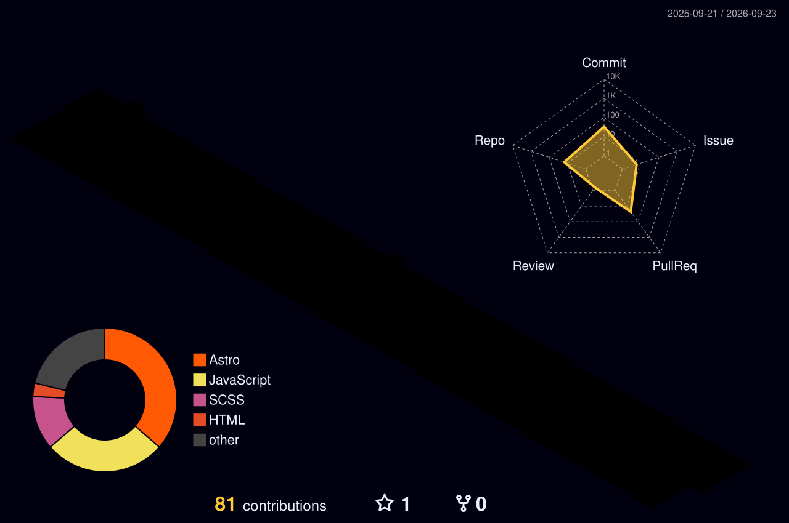

<div align="center">
  
</div>

<div align="center">
  <a href="https://github.com/iamrohitchavda">
    
  </a>
</div>

<div align="center">
  
  
  
</div>

---

## whoami

```ts
const rohit = {
  role:  "Full Stack Developer",
  ships: [
    "AI content generation UI",
    "profile analytics dashboards",
    "admin panels · MFA flows",
    "REST APIs + the data layer under them",
  ],
  stack: {
    front: ["React", "TypeScript", "Astro", "Tailwind"],
    back:  ["Node", "Express", "MongoDB"],
    tools: ["Git", "Docker", "Vite"],
  },
  debugged:  "40+ production bugs — the real curriculum",
  oss:       ["interledger/testnet", "Hacktoberfest x3"],
  community: "builds conference websites, unpaid",
  learning:  ["Server Components", "React Compiler", "concurrent rendering"],
};
```

I work across the stack — React and TypeScript on the frontend, Node and MongoDB behind it. Most
of what I actually know came from shipping a feature and then debugging it in production six weeks
later. Slower than a tutorial. Considerably more permanent.

I came into this from a tier-3 college with no campus placements and no one in tech to ask. Free
docs, free tooling and open communities are the only reason I got anywhere, so I put time back
into them.

---

## 🧊 My contributions, in 3D

<div align="center">
  
</div>

<sub align="center">Regenerated every day by a GitHub Action. Yes, it's a real 3D render of my commit history.</sub>

---

## 🛠 Stack

<div align="center">
  
</div>

---

## 🌍 Open Source & Community

I don't just attend community events — I build the websites they run on, unpaid.

| Project | What I did | Stack |
|---|---|---|
| **[Interledger / testnet](https://github.com/interledger/testnet)** | Upgraded `@headlessui/react` and refactored its usage across the app | React |
| **[Open Source Day](https://osd.opensourceweekend.org)** | Conference site — speakers, schedule, gallery, badge generator | Astro |
| **[Open Source Weekend](https://opensourceweekend.org)** | Community portal — events, job board | Astro |
| **[Best Practices Summit](https://bps.comexpocybersecurity.org)** | CXO summit site for The Hackers Meetup × ComExpo | HTML/CSS/JS |
| **Hacktoberfest** | Contributed every year, 3 years running | Various |

<details>
<summary><b>Why I build these for free →</b></summary>

<br>

I came from a place with no meetups, no user groups, and no seniors to ask. The Gujarat open
source community — OSW, OSCF, The Hackers Meetup — was the first place that answered my
questions without asking what college I went to.

I can't sponsor an event and I can't fly speakers in. What I can do is build the site. So that's
what I do, and I've done it for every event I could.

</details>

---

## 📊 The numbers

<div align="center">
  
  
</div>

<div align="center">
  
</div>

<div align="center">
  
</div>

<div align="center">
  
</div>

---

## 🐍 Watch my contributions get eaten

<div align="center">
  <picture>
    <source media="(prefers-color-scheme: dark)" srcset="https://raw.githubusercontent.com/iamrohitchavda/iamrohitchavda/output/github-snake-dark.svg" />
    <source media="(prefers-color-scheme: light)" srcset="https://raw.githubusercontent.com/iamrohitchavda/iamrohitchavda/output/github-snake.svg" />
    
  </picture>
</div>

---

## 🏅 Holopin badges

<div align="center">
  <a href="https://holopin.io/@rohitchavda">
    
  </a>
</div>

---

<details>
<summary><b>📌 Things I'm figuring out right now</b></summary>

<br>

- **React Server Components** — I understand the what. Still working through the when and the why-not.
- **The React Compiler** — how much of my `useMemo` habit it makes obsolete.
- **Concurrent rendering** — I've read about it. I have not yet been bitten by it, which means I don't really know it.
- **Testing** — the honest gap. I ship, then I fix. I'd like to invert that.

</details>

<details>
<summary><b>💬 Ask me about</b></summary>

<br>

- Debugging production React with no reproduction steps
- Working across the stack in a small team, where you own the bug end to end
- Getting into tech from a tier-3 college with no campus placements
- Running community conference sites on a zero-rupee budget

</details>

---

<div align="center">

### Find me

[](https://linkedin.com/in/iamrohitchavda)
[](https://cybertipshq.blogspot.com/)
[](https://github.com/iamrohitchavda)

<br>

<i>"Learning daily new things, improving myself."</i>


</div>
